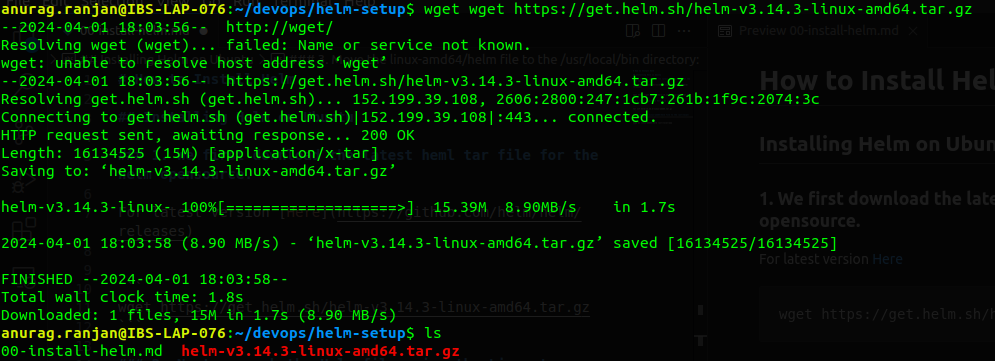
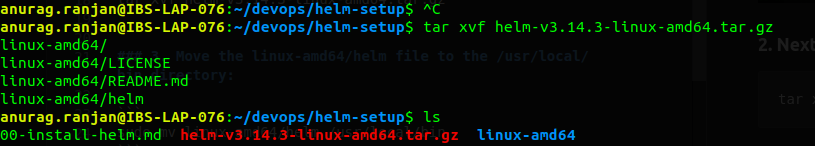
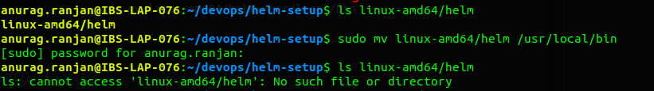
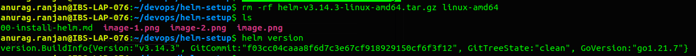

# How to Install Helm

## Installing Helm on Ubuntu

### 1. We first download the latest heml tar file for the helm opensource.

For latest version [Here](https://github.com/helm/helm/releases)


```
wget https://get.helm.sh/helm-v3.14.3-linux-amd64.tar.gz
```


### 2. Next, unpack the Helm file using the Linux tar command:  

```
tar xvf helm-v3.14.3-linux-amd64.tar.gz
```


### 3. Move the linux-amd64/helm file to the /usr/local/bin directory:

```
sudo mv linux-amd64/helm /usr/local/bin
```



### 4. Remove the downloaded file using the following command:

```
rm -rf helm-v3.14.3-linux-amd64.tar.gz linux-amd64
```

### 5. Finally, verify you have successfully installed Helm by checking the version of the software:

```
helm version
```
