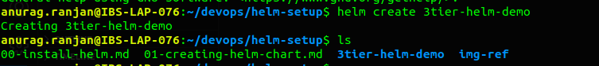
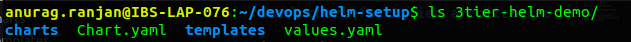
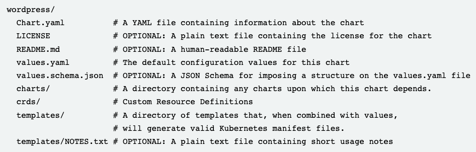
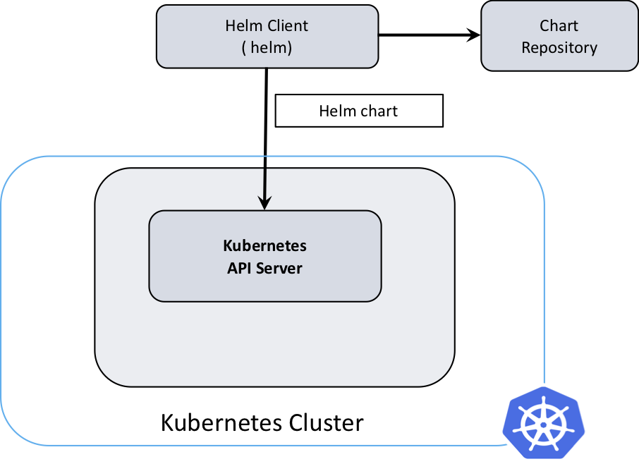
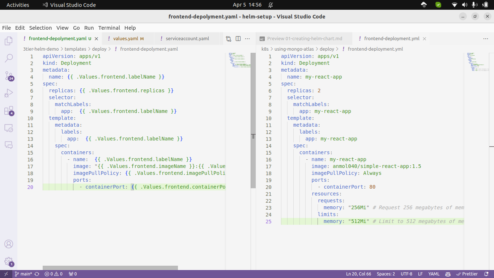
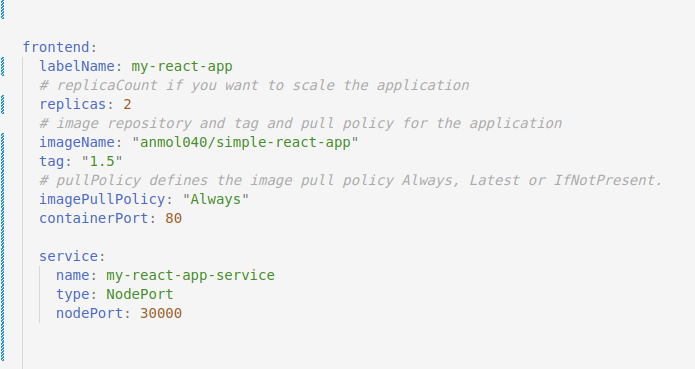
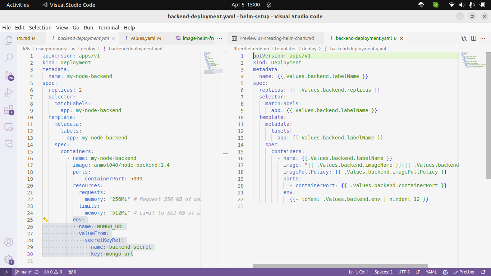
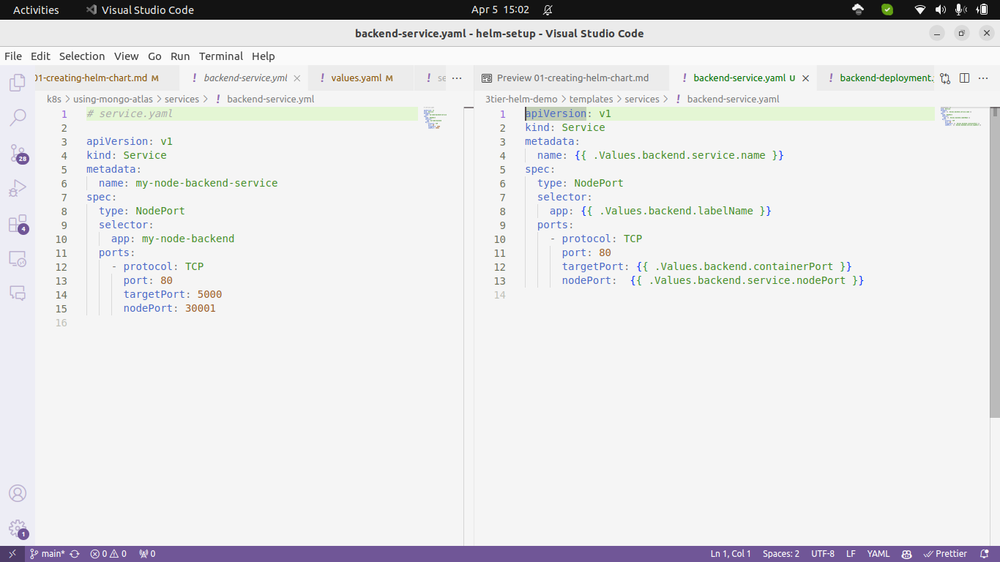
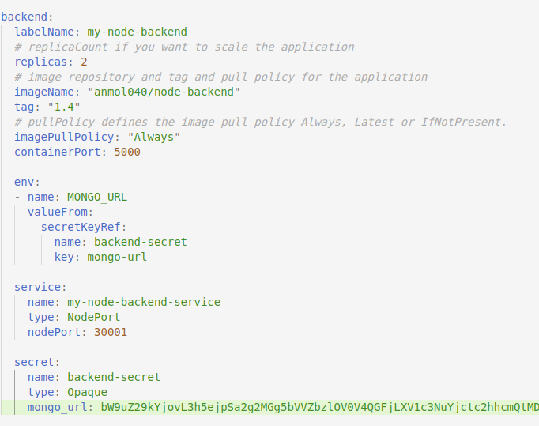

# Now we are going to create our heml chart for 3-tier architecture

## [Ref: How to make a Helm chart in 10 minutes](https://opensource.com/article/20/5/helm-charts)
## Starting a new Helm chart requires one simple command:

```
helm create 3tier-helm-demo
```


## Examine the chart's structure
Now that you have created the chart, take a look at its structure to see what's inside. 





 The first two files you see - `Chart.yaml` and `values.yaml` - define what the chart is and what values will be in it at deployment.

### Chart.yaml
The first part includes 
- API version that the chart is using (this is required)
- name of the chart
- description of the chart. 

The next section describes
- type of chart (an application by default)
- version of the chart you will deploy
- application version (which should be incremented as you make changes).


### templates/
The most important part of the chart is the template directory. It holds all the configurations for your application that will be deployed into the cluster. 

## Understand and edit values
Template files are set up with formatting that collects deployment information from the `values.yaml` file. 

[REF](https://opensource.com/article/20/5/helm-charts)


## How helm works



## kubernetes vs helm 


## Creating template for each deployment and services

### frontend-template




How we have assigned the values for the frontend-deployment-template


### backend-template

#### backend-deployment



#### backend-service

And here how I have associate the values of backend-deployment


