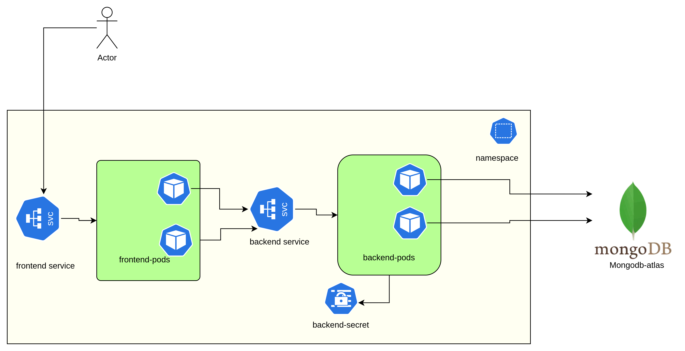
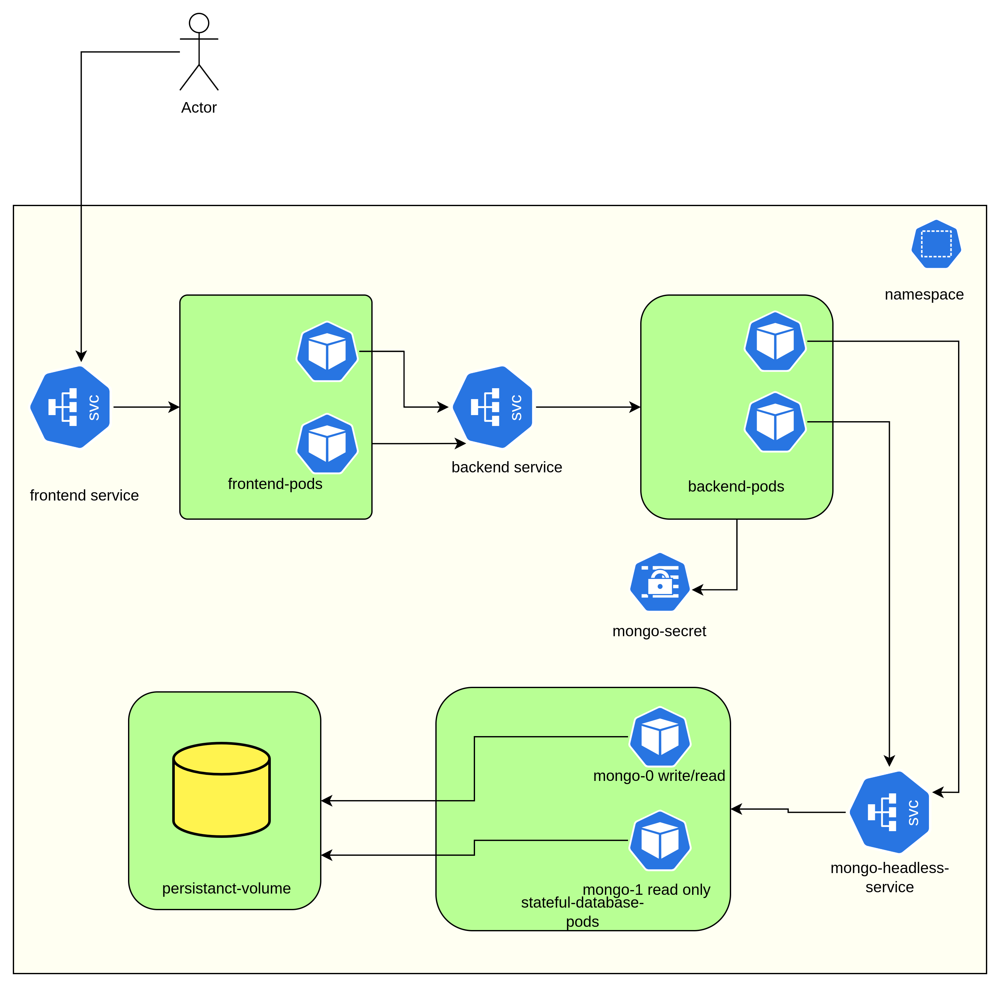

# Switching from MongoDB Atlas to Local MongoDB (localdb)

## Introduction:
This document outlines the reasons for transitioning from MongoDB Atlas, a managed cloud-based database service, to a local MongoDB database (localdb). It highlights the benefits of using localdb and provides a brief overview of the decision-making process.

## Reasons for Switching:
- `Cost Savings:` Eliminate ongoing costs associated with MongoDB Atlas, leading to significant savings.
- `Data Privacy and Security:` Ensure full control over data privacy and security by keeping data within our own infrastructure.
- Performance: Improve application performance by leveraging local resources and reducing network latency.
- `Offline Development and Testing:` Facilitate development and testing in offline or isolated environments without relying on external services.
- `Customization and Control:` Gain flexibility and control over database configuration and settings to meet specific project requirements.
- `Learning and Education:` Provide hands-on learning experience for developers and administrators to explore MongoDB features and administration tasks.

## Using mongodb-atlas

## Using mongodb-localdb

## Implementation Steps:

Since we are using kubernetes to deploy our architecture so for this setup we are going to create a mongodb `mongo-deployment.yml`, `headless-service.yml`,`persistant-volume.yml` which will be responsible for our servers and connections.

## Conclusion:
Switching from MongoDB Atlas to local MongoDB (localdb) offers cost savings, improved data privacy and security, better performance, and enhanced control over database environments. By following the implementation steps outlined in this document, we can seamlessly transition to localdb while maximizing the benefits for our project.